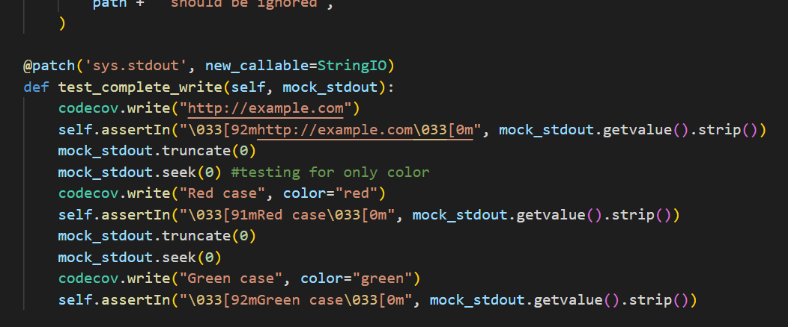

# Report for Assignment 1 resit

## Project chosen

Name: Codecov-Python

URL: https://github.com/codecov/codecov-python

Number of lines of code and the tool used to count it: 1900 lines of code, using lizard

Programming language: Python

## Coverage measurement with existing tool

The name of the existing tool that was used is "coverage" for python and it has been used with the unnitest discover function for the tests folder inside the project.

## Coverage improvement

### Individual tests

<The following is supposed to be repeated for each function (2 in total)>

<Function 1> - (def write)

<State the coverage improvement with a number and elaborate on why the coverage is improved>

The coverage improvement for the whole project has grown with 2% after this enhacement, and the coverage is improved because it takes into consideration a few cases the initial branch testing did not account for such as the "https//: starting cases" or the non matching colored texts(as seen in coverage.xml screenshot)

<Function 2> - (remove_non_ascii/_add_env_if_not_empty)

<State the coverage improvement with a number and elaborate on why the coverage is improved>

The coverage improvement for the whole project has grown with 2% after this enhacement, and the coverage is improved because it takes into consideration the cases for the 2 functions in question which were not tested during the branch testing done(as seen in coverage.xml screenshot)

### Overall

